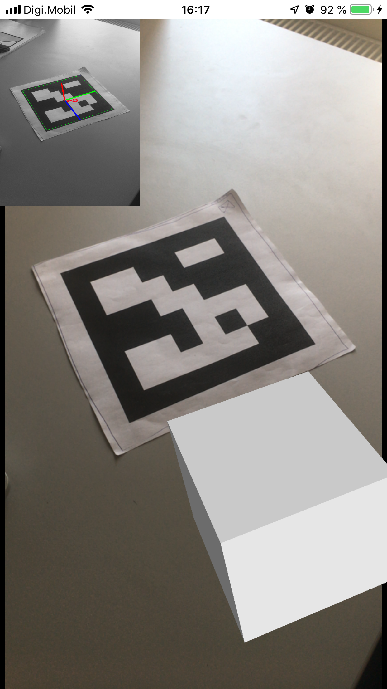

# ArucoAugmentedReality

Sample programs for OpenCV and Swift and iOS .
I'm trying to make augmented reality demo project with simple 3d object in center of marker.

without success.

video on youtube with problem: [https://www.youtube.com/watch?v=DF9JPv35XzE](https://www.youtube.com/watch?v=DF9JPv35XzE)

## OpenCV

Those projects uses OpenCV version 3.4.0.
However, OpenCV binary isn't include in those projects.
You can get OpenCV binary by following steps.

### OpenCV for iOS

A binary version is available as it is.

1. Download `opencv-3.4.0-ios-framework.zip` from [https://sourceforge.net/projects/opencvlibrary/files/opencv-ios/3.4.0/opencv-3.4.0-ios-framework.zip/download](https://sourceforge.net/projects/opencvlibrary/files/opencv-ios/3.4.0/opencv-3.4.0-ios-framework.zip/download).
2. Unpack the file.
3. Copy `opencv2.framework` into `ArucoAugmentedReality` directory.
